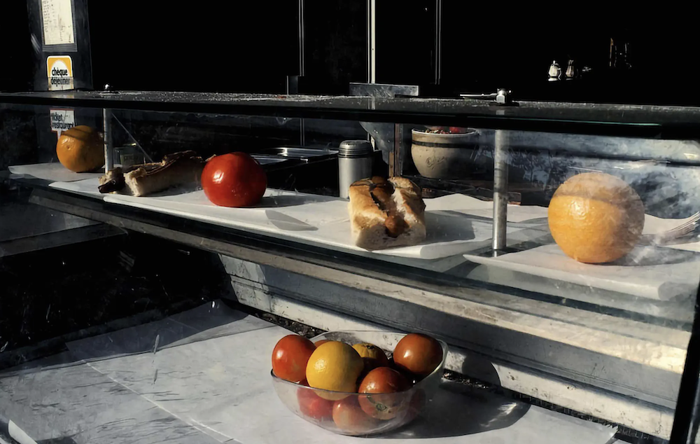

ʕง•ᴥ•ʔง

👋嗨，我是「Bear」

排版、运动设计、文案写作、表演——网络是无穷无尽的机会和创造力的媒介，我只触及了表面。

「小熊」是一个刚开始的博客，记录每天的美好、思考，也许有一天还要发表一本书。

<html lang='en'>
<meta charset='UTF-8'>
<meta name='viewport' content='width=device-width, initial-scale=1'>
<link rel='apple-touch-icon' sizes='180x180' href='/apple-touch-icon.png'>
<link rel='icon' type='image/png' sizes='32x32' href='/favicon-32x32.png'>
<link rel='icon' type='image/png' sizes='16x16' href='/favicon-16x16.png'>
<link rel='manifest' href='/site.webmanifest'>

<title>about me</title>
<meta name='description' content='about my days status updates'>

<header>
<strong><a href='/'>&#128193; about me | come back</a></strong>
</header>

   
<strong><a href='/?orma=159'>09-06,24</a></strong> 

   
  
学会主动思考，才能有更好的见解，无论是生活还是对世界了解。

  
<strong><a href='/?orma=157'>05-31,24</a></strong> 

  
  
分享一个不错的picture

  
<strong><a href='/?orma=155'>12-01, 23</a></strong> 

  
 <video controls="" height="auto" width="100%" muted="" autoplay="" src="images/web/zip1.mp4"></video> 
听听音乐，享受生活。

